# 🛤️ Abhidhamma-Rails Workflow Chart

This document provides a visual and structured map of the **Abhidhamma-Rails** pipeline, defining how knowledge flows from raw human-authored sources through descriptive rails to highly controlled, prescriptive translations, adaptations, and ultimately, to the final calendar-driven **Daily Plans**.

---

## 1. Top-Level Pipeline Architecture

The vault functions as a four-stage pipeline. Information flows strictly **one-way** from left to right, culminating in the Daily Plans as the ultimate final product.

```mermaid
flowchart LR
    %% Styles
    classDef source fill:#f5f6fa,stroke:#44bd32,stroke-width:2px,color:#2f3640;
    classDef rail fill:#f5f6fa,stroke:#00a8ff,stroke-width:2px,color:#2f3640;
    classDef trans fill:#f5f6fa,stroke:#e84118,stroke-width:2px,color:#2f3640;
    classDef system fill:#f5f6fa,stroke:#718093,stroke-width:2px,color:#2f3640;
    classDef final fill:#fff0f6,stroke:#d6336c,stroke-width:2.5px,color:#d6336c;

    subgraph S1 ["1-SOURCES"]
        direction TB
        A["Root Texts"]:::source
        B["Commentaries"]:::source
        C["Translations"]:::source
    end

    subgraph S2 ["2-RAILS"]
        direction TB
        D["Section Summaries"]:::rail
        E["Verse Contexts"]:::rail
        F["Local-Wiki Definitions"]:::rail
        G["Bilingual Glossaries"]:::rail
    end

    subgraph S3 ["3-TRANSFORMATIONS"]
        direction TB
        H["Translation Tracks"]:::trans
        I["Audience Adaptations"]:::trans
        J["Daily Study Plans<br><i>(Ultimate Final Product)</i>"]:::final
    end

    subgraph S4 ["4-SYSTEM"]
        direction TB
        K["Workflows & Skills"]:::system
        L["Templates & Guides"]:::system
    end

    S1 -->|Strict Citation Chain| S2
    S2 -->|Context-Grounded Generation| S3
    H -->|Embedded for Meaning| J
    I -.->|Feeds Practice/Reflection| J
    S4 -.->|Drives & Governs| S1
    S4 -.->|Drives & Governs| S2
    S4 -.->|Drives & Governs| S3
```



---

## 2. Detailed Production Pipeline

Below is the step-by-step workflow for producing the final calendar-driven Daily Plans (e.g., `Plans/Daily-Tipitaka/`). It is divided into four sequential phases to prevent hallucinations, terminology inconsistency, style drift, and to ensure perfect alignment between chanting, translation, and commentary.

```mermaid
flowchart TD
    %% Styles
    classDef phase fill:#f1f2f6,stroke:#3742fa,stroke-width:2px,stroke-dasharray: 5 5,color:#2f3640;
    classDef item fill:#ffffff,stroke:#2f3640,stroke-width:1px,color:#2f3640;
    classDef db fill:#f5f6fa,stroke:#7f8fa6,stroke-width:2px,color:#2f3640;
    classDef process fill:#ffeaa7,stroke:#fdcb6e,stroke-width:1px,color:#2f3640;
    classDef complete fill:#e3fafc,stroke:#0c8599,stroke-width:2px,color:#0c8599;
    classDef final fill:#fff0f6,stroke:#d6336c,stroke-width:2.5px,color:#d6336c;

    subgraph Phase1 ["Phase 1: Context Preparation (2-RAILS/)"]
        direction TB
        1a["1a. Section-Level Context<br><i>2-RAILS/Sections/[node].md</i><br>(Raw & Combined Summaries)"]:::item
        1b["1b. Verse-Level Context<br><i>2-RAILS/Verses/[verse].md</i><br>(Disambiguated Restatements)"]:::item
        1c["1c. Word-Level Context<br><i>2-RAILS/Local-Wiki/[term].md</i><br>(Commentary Definitions)"]:::item
        1d["1d. Glossary Chain<br><i>Bilingual-Glossaries/ -> termbase.md</i><br>(Consolidated Vocabulary)"]:::item
    end

    subgraph Phase2 ["Phase 2: Translation (3-TRANSFORMATIONS/)"]
        direction TB
        T_REQ["Style Contract<br><i>requirements.md</i>"]:::db
        T_TERM["Vocabulary Contract<br><i>termbase.md</i>"]:::db
        T_OUT["Draft Output<br><i>[output].md</i>"]:::item
        
        T_PROC[["Batch Translation Skill<br>(translate-section)"]]:::process
    end

    subgraph Phase3 ["Phase 3: QA & Review (3-TRANSFORMATIONS/)"]
        direction TB
        QA_REP["QA Report<br><i>qa-report.md</i><br>(MQM Taxonomy Analysis)"]:::item
        QA_PROC[["Translation QA Skill<br>(translation-qa)"]]:::process
        STYLE_PROC[["Style Consistency Skill<br>(style-consistency-check)"]]:::process
        
        DONE["Status: Complete<br>(Translation Track Output)"]:::complete
    end

    subgraph Phase4 ["Phase 4: Plan Assembly (3-TRANSFORMATIONS/Plans/)"]
        direction TB
        P_REQ["Plan Style Contract<br><i>requirements.md</i>"]:::db
        P_TERM["Plan Vocabulary Contract<br><i>termbase.md</i>"]:::db
        P_SCHED["Plan Calendar<br><i>schedule.md</i>"]:::db
        
        P_PROC[["Plan Assembly Workflow<br>(Assemble 7-Step Day Files)"]]:::process
        
        FINAL_OUT["Daily Plan Day Files<br><i>days/day-N.md</i><br>(Canonical Publishing Units)"]:::final
        COMM_OUT["Outreach & Notifications<br><i>communication/ & notifications</i>"]:::item
    end

    %% Phase 1 to Phase 2 Flow
    1a -.->|Section Context| T_PROC
    1b -.->|Disambiguated Restatements| T_PROC
    1c -.->|Term Definitions| T_PROC
    1d -->|Populates| T_TERM

    %% Phase 2 Internal Flow
    T_REQ -.->|Style Constraints| T_PROC
    T_TERM -.->|Prescriptive Terms| T_PROC
    T_PROC --> T_OUT

    %% Phase 2 to Phase 3 Flow
    T_OUT --> QA_PROC
    QA_PROC -->|Flags Errors| QA_REP
    STYLE_PROC -->|Flags Style Drift| QA_REP
    QA_REP -->|Drives Revisions| T_PROC
    
    T_OUT -.->|No Critical/Major Errors| DONE

    %% Phase 3 to Phase 4 Flow (Assembling the Final Product)
    DONE -->|Embeds Approved Translation| P_PROC
    1a -.->|Section Context<br>(Chanting Guide)| P_PROC
    1b -.->|Verse Context<br>(Pāli Chanting)| P_PROC
    1c -.->|Word Definitions<br>(Word of the Day)| P_PROC
    
    %% Phase 4 Internal Flow
    P_REQ -.->|Style Constraints| P_PROC
    P_TERM -.->|Prescriptive Terms| P_PROC
    P_SCHED -.->|Calendar Schedule| P_PROC
    P_PROC --> FINAL_OUT
    P_PROC --> COMM_OUT
```

---

## 3. The Rules of the Pipeline

1. **One-Way Citation Chain:** 
   * `1-SOURCES/` $\rightarrow$ `2-RAILS/` $\rightarrow$ `3-TRANSFORMATIONS/`
   * Translations and adaptations must **never** cite `1-SOURCES/` directly, bypassing the rails.
   * If a concept or text is not yet compiled in `2-RAILS/`, it cannot be translated.
2. **Descriptive Rails vs. Prescriptive Transformations:**
   * **Rails (`2-RAILS/`)** are *descriptive*—they record every commentator's reading, historical rendering, and linguistic nuance.
   * **Transformations (`3-TRANSFORMATIONS/`)** are *prescriptive*—they choose exactly **one** style contract (`requirements.md`) and **one** term mapping (`termbase.md`) for their specific target audience.
3. **Small-Batch Processing:**
   * Translation is never done on the whole text at once. It proceeds in small batches of Table of Contents (TOC) nodes to ensure focus and prevent quality degradation.
4. **Completion Criterion:**
   * A translation is marked `status: complete` only when its corresponding entries in `qa-report.md` have no outstanding critical or major MQM errors.
5. **Daily Plans as the Ultimate Destination:**
   * The ultimate goal of the entire pipeline is the generation of calendar-driven **Daily Plans** (e.g., `Plans/Daily-Tipitaka/`).
   * Daily plan files (`days/day-N.md`) are the final publishing units. They are assembled by pulling from the completed rails and embedding the approved, `status: complete` translation track outputs.
   * A daily plan session never bypasses the pipeline; it represents the final synthesis where translation, commentary, and practical reflection come together for the practitioner.
